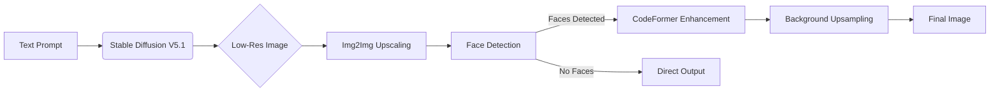

# SD-1.5-Image-Generation-

# AI Image Generation & Enhancement System


prompt "a single high class beautiful young lady in a pretty western old money style dress , 8k uhd, natural light , studio flashes,  high skin quality,  perfect female anatomy."
<!-- Add actual image link here -->
prompt " a single beautiful girl in studio,  8k uhd , high definition skin , natural detailed poses,  high end quality, natural light "

This application combines Stable Diffusion image generation with state-of-the-art enhancement techniques to create high-quality images from text prompts. The system features facial enhancement with CodeFormer and multiple background upsampling options.

## Key Features

- **Text-to-Image Generation**: Create images from text prompts using Stable Diffusion V5.1
- **AI-Powered Enhancement**:
  - Facial refinement with CodeFormer (adjustable enhancement strength)
  - Background upsampling with multiple models:
    - SwinIR (high-quality detail reconstruction)
    - RealESRGAN x4plus (general-purpose upscaling)
    - 4x Foolhardy Remacri (specialized ESRGAN model)
- **Intelligent Face Detection**: Automatic facial enhancement when faces are detected
- **Custom Resolution**: Generate images at any resolution between 128x128 and 1024x1024
- **Production-Ready Interface**: Gradio-based UI with real-time status updates

## Technical Architecture



## Requirements

- Python 3.8+
- NVIDIA GPU with ≥8GB VRAM
- CUDA 11.x
- Linux (recommended) or Windows WSL2

## Installation

```bash
# Clone repository
git clone https://github.com/aryankushwaha09/SD-1.5-Image-Generation-.git
cd image-generation-app

# Create virtual environment
python -m venv venv
source venv/bin/activate  # Linux/macOS
# venv\Scripts\activate  # Windows

# Install dependencies
pip install -r requirements.txt
```

## Usage

1. Launch the application:
```bash
python app.py
```

2. Access the web interface at `http://localhost:7860`

3. Configure parameters:
   - **Prompt**: Describe your desired image
   - **CodeFormer Weight**: Control facial enhancement strength (0 = minimal, 1 = maximum)
   - **Upsampler**: Select background enhancement model
   - **Dimensions**: Set image height/width (multiples of 64 recommended)

4. Click "Submit" to generate and process your image

## Output Processing

The system follows this enhancement pipeline:
1. Generate base image (512px)
2. Upscale 2x using img2img diffusion
3. Detect faces using OpenCV Haar Cascade
4. Enhance faces with CodeFormer
5. Upscale background with selected model
6. Combine enhanced components into final image

## Performance Notes

- Initial run will download models (~8GB total)
- Generation time: 1-3 minutes depending on resolution
- VRAM requirements:
  - 6GB for 640x960
  - 8GB+ for 1024x1024
- For faster inference, use `torch.compile()` (requires CUDA 11.7+)

## Customization Options

To modify the application:
- Change base model: Replace `Realistic_Vision_V5.1_fp16-no-ema.safetensors`
- Add new upsamplers: Implement in enhancement pipeline
- Adjust face detection: Modify `detect_faces_opencv()` parameters
- Change output quality: Edit CodeFormer inference parameters

## License

This project is licensed under the MIT License - see [LICENSE](LICENSE) for details.

## Acknowledgements

- Stable Diffusion by Stability AI
- CodeFormer by sczhou
- SwinIR by Jingyun Liang
- RealESRGAN by Xinntao

- ## purpose
- design for basically low end GPU which have low ram and also for vms
- everything just to make things works under low resources 
## Recommended File Structure
```
project-root/
├── app.py                   # Main application code
├── README.md                # This documentation
├── requirements.txt         # Python dependencies
├── models/                  # Downloaded models (auto-created)
│   ├── Realistic_Vision_V5.1_fp16-no-ema.safetensors
│   └── enhancement_models/
├── outputs/                 # Generated images
│   ├── intermediates/
│   └── final_results/
└── assets/                  # Documentation images
    └── workflow-diagram.png
```
